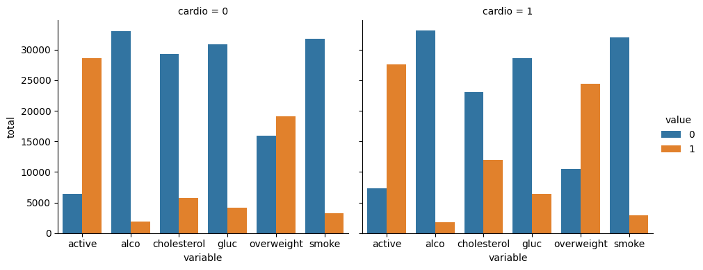
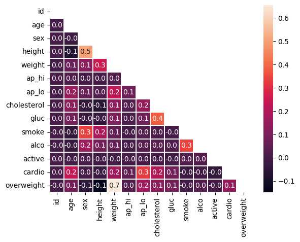

# Medical Data Visualizer
In this project, you will visualize and make calculations from medical examination data using matplotlib, seaborn, and pandas. The dataset values were collected during medical examinations.

## Data description

The rows in the dataset represent patients and the columns represent information like body measurements, results from various blood tests, and lifestyle choices. You will use the dataset to explore the relationship between cardiac disease, body measurements, blood markers, and lifestyle choices.

File name: medical_examination.csv

| Feature | Variable Type | Variable | Value Type |
|--|--|--|--|
| Age | Objective Feature | `age` | int (days) |
| Height | Objective Feature | `height` | int (cm) |
| Weight | Objective Feature | `weight` | float (kg) |
| Gender | Objective Feature | `sex` | categorical code |
| Systolic blood pressure | Examination Feature | `ap_hi` | int |
| Diastolic blood pressure | Examination Feature | `ap_lo` | int |
| Cholesterol | Examination Feature | `cholesterol` | 1: normal, 2: above normal, 3: well above normal |
| Glucose | Examination Feature | `gluc` | 1: normal, 2: above normal, 3: well above normal |
| Smoking | Subjective Feature | `smoke` | binary |
| Alcohol intake | Subjective Feature | `alco` | binary |
| Physical activity | Subjective Feature | `active` | binary |
| Presence or absence of cardiovascular disease | Target Variable | `cardio` | binary |

## Tasks

Create a chart similar to  `examples/Figure_1.png`, where we show the counts of good and bad outcomes for the  `cholesterol`,  `gluc`,  `alco`,  `active`, and  `smoke`  variables for patients with cardio=1 and cardio=0 in different panels.

Use the data to complete the following tasks in  `medical_data_visualizer.py`:

-   Add an  `overweight`  column to the data. To determine if a person is overweight, first calculate their BMI by dividing their weight in kilograms by the square of their height in meters. If that value is > 25 then the person is overweight. Use the value 0 for NOT overweight and the value 1 for overweight.
-   Normalize the data by making 0 always good and 1 always bad. If the value of  `cholesterol`  or  `gluc`  is 1, make the value 0. If the value is more than 1, make the value 1.
-   Convert the data into long format and create a chart that shows the value counts of the categorical features using seaborn's  `catplot()`. The dataset should be split by 'Cardio' so there is one chart for each  `cardio`  value. The chart should look like  `examples/Figure_1.png`.
-   Clean the data. Filter out the following patient segments that represent incorrect data:
    -   diastolic pressure is higher than systolic (Keep the correct data with  `(df['ap_lo'] <= df['ap_hi'])`)
    -   height is less than the 2.5th percentile (Keep the correct data with  `(df['height'] >= df['height'].quantile(0.025))`)
    -   height is more than the 97.5th percentile
    -   weight is less than the 2.5th percentile
    -   weight is more than the 97.5th percentile
-   Create a correlation matrix using the dataset. Plot the correlation matrix using seaborn's  `heatmap()`. Mask the upper triangle. The chart should look like  `examples/Figure_2.png`.

Any time a variable is set to  `None`, make sure to set it to the correct code.

Link to the original subject: https://www.freecodecamp.org/learn/data-analysis-with-python/data-analysis-with-python-projects/medical-data-visualizer

# My Work
To tackle this project, I'm going to go over each bullet point until there is none remaining.

## Add an  `overweight`  column to the data. To determine if a person is overweight, first calculate their BMI by dividing their weight in kilograms by the square of their height in meters. If that value is > 25 then the person is overweight. Use the value 0 for NOT overweight and the value 1 for overweight.
First, let's import our data.


```python
import pandas as pd
import seaborn as sns
import matplotlib.pyplot as plt
import numpy as np

df = pd.read_csv("medical_examination.csv")
df.head()
```


<div>
<style scoped>
    .dataframe tbody tr th:only-of-type {
        vertical-align: middle;
    }

    .dataframe tbody tr th {
        vertical-align: top;
    }

    .dataframe thead th {
        text-align: right;
    }
</style>
<table border="1" class="dataframe">
  <thead>
    <tr style="text-align: right;">
      <th></th>
      <th>id</th>
      <th>age</th>
      <th>sex</th>
      <th>height</th>
      <th>weight</th>
      <th>ap_hi</th>
      <th>ap_lo</th>
      <th>cholesterol</th>
      <th>gluc</th>
      <th>smoke</th>
      <th>alco</th>
      <th>active</th>
      <th>cardio</th>
    </tr>
  </thead>
  <tbody>
    <tr>
      <th>0</th>
      <td>0</td>
      <td>18393</td>
      <td>2</td>
      <td>168</td>
      <td>62.0</td>
      <td>110</td>
      <td>80</td>
      <td>1</td>
      <td>1</td>
      <td>0</td>
      <td>0</td>
      <td>1</td>
      <td>0</td>
    </tr>
    <tr>
      <th>1</th>
      <td>1</td>
      <td>20228</td>
      <td>1</td>
      <td>156</td>
      <td>85.0</td>
      <td>140</td>
      <td>90</td>
      <td>3</td>
      <td>1</td>
      <td>0</td>
      <td>0</td>
      <td>1</td>
      <td>1</td>
    </tr>
    <tr>
      <th>2</th>
      <td>2</td>
      <td>18857</td>
      <td>1</td>
      <td>165</td>
      <td>64.0</td>
      <td>130</td>
      <td>70</td>
      <td>3</td>
      <td>1</td>
      <td>0</td>
      <td>0</td>
      <td>0</td>
      <td>1</td>
    </tr>
    <tr>
      <th>3</th>
      <td>3</td>
      <td>17623</td>
      <td>2</td>
      <td>169</td>
      <td>82.0</td>
      <td>150</td>
      <td>100</td>
      <td>1</td>
      <td>1</td>
      <td>0</td>
      <td>0</td>
      <td>1</td>
      <td>1</td>
    </tr>
    <tr>
      <th>4</th>
      <td>4</td>
      <td>17474</td>
      <td>1</td>
      <td>156</td>
      <td>56.0</td>
      <td>100</td>
      <td>60</td>
      <td>1</td>
      <td>1</td>
      <td>0</td>
      <td>0</td>
      <td>0</td>
      <td>0</td>
    </tr>
  </tbody>
</table>
</div>


Then, we can add the overweight column.


```python
df["overweight"] = df["weight"] / ( (df["height"] * 0.01) ** 2 )
df.loc[df["overweight"] <= 25, ["overweight"]] = 0
df.loc[df["overweight"] > 25, ["overweight"]] = 1
df = df.astype({"overweight": int})
df.head()
```


<div>
<style scoped>
    .dataframe tbody tr th:only-of-type {
        vertical-align: middle;
    }

    .dataframe tbody tr th {
        vertical-align: top;
    }

    .dataframe thead th {
        text-align: right;
    }
</style>
<table border="1" class="dataframe">
  <thead>
    <tr style="text-align: right;">
      <th></th>
      <th>id</th>
      <th>age</th>
      <th>sex</th>
      <th>height</th>
      <th>weight</th>
      <th>ap_hi</th>
      <th>ap_lo</th>
      <th>cholesterol</th>
      <th>gluc</th>
      <th>smoke</th>
      <th>alco</th>
      <th>active</th>
      <th>cardio</th>
      <th>overweight</th>
    </tr>
  </thead>
  <tbody>
    <tr>
      <th>0</th>
      <td>0</td>
      <td>18393</td>
      <td>2</td>
      <td>168</td>
      <td>62.0</td>
      <td>110</td>
      <td>80</td>
      <td>1</td>
      <td>1</td>
      <td>0</td>
      <td>0</td>
      <td>1</td>
      <td>0</td>
      <td>0</td>
    </tr>
    <tr>
      <th>1</th>
      <td>1</td>
      <td>20228</td>
      <td>1</td>
      <td>156</td>
      <td>85.0</td>
      <td>140</td>
      <td>90</td>
      <td>3</td>
      <td>1</td>
      <td>0</td>
      <td>0</td>
      <td>1</td>
      <td>1</td>
      <td>1</td>
    </tr>
    <tr>
      <th>2</th>
      <td>2</td>
      <td>18857</td>
      <td>1</td>
      <td>165</td>
      <td>64.0</td>
      <td>130</td>
      <td>70</td>
      <td>3</td>
      <td>1</td>
      <td>0</td>
      <td>0</td>
      <td>0</td>
      <td>1</td>
      <td>0</td>
    </tr>
    <tr>
      <th>3</th>
      <td>3</td>
      <td>17623</td>
      <td>2</td>
      <td>169</td>
      <td>82.0</td>
      <td>150</td>
      <td>100</td>
      <td>1</td>
      <td>1</td>
      <td>0</td>
      <td>0</td>
      <td>1</td>
      <td>1</td>
      <td>1</td>
    </tr>
    <tr>
      <th>4</th>
      <td>4</td>
      <td>17474</td>
      <td>1</td>
      <td>156</td>
      <td>56.0</td>
      <td>100</td>
      <td>60</td>
      <td>1</td>
      <td>1</td>
      <td>0</td>
      <td>0</td>
      <td>0</td>
      <td>0</td>
      <td>0</td>
    </tr>
  </tbody>
</table>
</div>


## Normalize the data by making 0 always good and 1 always bad. If the value of  `cholesterol`  or  `gluc`  is 1, make the value 0. If the value is more than 1, make the value 1.


```python
df.loc[df["cholesterol"] == 1,"cholesterol"] = 0
df.loc[df["cholesterol"] > 1,"cholesterol"] = 1
df.loc[df["gluc"] == 1,"gluc"] = 0
df.loc[df["gluc"] > 1,"gluc"] = 1
df.head()
```


<div>
<style scoped>
    .dataframe tbody tr th:only-of-type {
        vertical-align: middle;
    }

    .dataframe tbody tr th {
        vertical-align: top;
    }

    .dataframe thead th {
        text-align: right;
    }
</style>
<table border="1" class="dataframe">
  <thead>
    <tr style="text-align: right;">
      <th></th>
      <th>id</th>
      <th>age</th>
      <th>sex</th>
      <th>height</th>
      <th>weight</th>
      <th>ap_hi</th>
      <th>ap_lo</th>
      <th>cholesterol</th>
      <th>gluc</th>
      <th>smoke</th>
      <th>alco</th>
      <th>active</th>
      <th>cardio</th>
      <th>overweight</th>
    </tr>
  </thead>
  <tbody>
    <tr>
      <th>0</th>
      <td>0</td>
      <td>18393</td>
      <td>2</td>
      <td>168</td>
      <td>62.0</td>
      <td>110</td>
      <td>80</td>
      <td>0</td>
      <td>0</td>
      <td>0</td>
      <td>0</td>
      <td>1</td>
      <td>0</td>
      <td>0</td>
    </tr>
    <tr>
      <th>1</th>
      <td>1</td>
      <td>20228</td>
      <td>1</td>
      <td>156</td>
      <td>85.0</td>
      <td>140</td>
      <td>90</td>
      <td>1</td>
      <td>0</td>
      <td>0</td>
      <td>0</td>
      <td>1</td>
      <td>1</td>
      <td>1</td>
    </tr>
    <tr>
      <th>2</th>
      <td>2</td>
      <td>18857</td>
      <td>1</td>
      <td>165</td>
      <td>64.0</td>
      <td>130</td>
      <td>70</td>
      <td>1</td>
      <td>0</td>
      <td>0</td>
      <td>0</td>
      <td>0</td>
      <td>1</td>
      <td>0</td>
    </tr>
    <tr>
      <th>3</th>
      <td>3</td>
      <td>17623</td>
      <td>2</td>
      <td>169</td>
      <td>82.0</td>
      <td>150</td>
      <td>100</td>
      <td>0</td>
      <td>0</td>
      <td>0</td>
      <td>0</td>
      <td>1</td>
      <td>1</td>
      <td>1</td>
    </tr>
    <tr>
      <th>4</th>
      <td>4</td>
      <td>17474</td>
      <td>1</td>
      <td>156</td>
      <td>56.0</td>
      <td>100</td>
      <td>60</td>
      <td>0</td>
      <td>0</td>
      <td>0</td>
      <td>0</td>
      <td>0</td>
      <td>0</td>
      <td>0</td>
    </tr>
  </tbody>
</table>
</div>


## Convert the data into long format and create a chart that shows the value counts of the categorical features using seaborn's  `catplot()`. The dataset should be split by 'Cardio' so there is one chart for each  `cardio`  value.
First we need to arrange the data correctly, to keep only the required fields.


```python
df_cat = pd.melt(df, id_vars=['cardio'], value_vars=['cholesterol','gluc','smoke','alco','active','overweight'])
df_cat.head()
```


<div>
<style scoped>
    .dataframe tbody tr th:only-of-type {
        vertical-align: middle;
    }

    .dataframe tbody tr th {
        vertical-align: top;
    }

    .dataframe thead th {
        text-align: right;
    }
</style>
<table border="1" class="dataframe">
  <thead>
    <tr style="text-align: right;">
      <th></th>
      <th>cardio</th>
      <th>variable</th>
      <th>value</th>
    </tr>
  </thead>
  <tbody>
    <tr>
      <th>0</th>
      <td>0</td>
      <td>cholesterol</td>
      <td>0</td>
    </tr>
    <tr>
      <th>1</th>
      <td>1</td>
      <td>cholesterol</td>
      <td>1</td>
    </tr>
    <tr>
      <th>2</th>
      <td>1</td>
      <td>cholesterol</td>
      <td>1</td>
    </tr>
    <tr>
      <th>3</th>
      <td>1</td>
      <td>cholesterol</td>
      <td>0</td>
    </tr>
    <tr>
      <th>4</th>
      <td>0</td>
      <td>cholesterol</td>
      <td>0</td>
    </tr>
  </tbody>
</table>
</div>


Then, we need to group together the "variable" field.


```python
df_cat2 = df_cat.groupby("variable").value_counts().reset_index()
df_cat2.columns = ["variable", "cardio", "value", "total"]
df_cat2.head()
```


<div>
<style scoped>
    .dataframe tbody tr th:only-of-type {
        vertical-align: middle;
    }

    .dataframe tbody tr th {
        vertical-align: top;
    }

    .dataframe thead th {
        text-align: right;
    }
</style>
<table border="1" class="dataframe">
  <thead>
    <tr style="text-align: right;">
      <th></th>
      <th>variable</th>
      <th>cardio</th>
      <th>value</th>
      <th>total</th>
    </tr>
  </thead>
  <tbody>
    <tr>
      <th>0</th>
      <td>active</td>
      <td>0</td>
      <td>1</td>
      <td>28643</td>
    </tr>
    <tr>
      <th>1</th>
      <td>active</td>
      <td>1</td>
      <td>1</td>
      <td>27618</td>
    </tr>
    <tr>
      <th>2</th>
      <td>active</td>
      <td>1</td>
      <td>0</td>
      <td>7361</td>
    </tr>
    <tr>
      <th>3</th>
      <td>active</td>
      <td>0</td>
      <td>0</td>
      <td>6378</td>
    </tr>
    <tr>
      <th>4</th>
      <td>alco</td>
      <td>1</td>
      <td>0</td>
      <td>33156</td>
    </tr>
  </tbody>
</table>
</div>


And now, we can finally draw our plot.


```python
my_plot = sns.catplot(
    data=df_cat2,
    kind="bar",
    x="variable",
    y="total",
    hue="value",
    col="cardio",
    height=4,
    aspect=1.2
)
```


    

    


By looking at the results of this plot, we can make the following affirmations about having cardiovascular diseases:
- It doesn't seem to like Physical activity (active), Alcohol intake (alco) and Smoking (smoke) affect the presence of cardiovascular diseases because it seems like we have almost the same ratios on those variables for people having cardiovascular diseases and people not having them.
- On the flip side, it looks like Cholesterol (cholesterol), Glucose (gluc) and being Overweight (overweight) affect the presence of cardiovascular diseases because between the ratios on those variables for people having cardiovascular diseases and people not having them, even with the eye test we can see a clear difference.

## Clean the data. Filter out the following patient segments that represent incorrect data.


```python
df_heat = df[
    (df['ap_lo'] <= df['ap_hi']) &
    (df['height'] >= df['height'].quantile(0.025)) &
    (df['height'] <= df['height'].quantile(0.975)) &
    (df['weight'] >= df['weight'].quantile(0.025)) &
    (df['weight'] <= df['weight'].quantile(0.975)) 
]
df_heat.head()
```


<div>
<style scoped>
    .dataframe tbody tr th:only-of-type {
        vertical-align: middle;
    }

    .dataframe tbody tr th {
        vertical-align: top;
    }

    .dataframe thead th {
        text-align: right;
    }
</style>
<table border="1" class="dataframe">
  <thead>
    <tr style="text-align: right;">
      <th></th>
      <th>id</th>
      <th>age</th>
      <th>sex</th>
      <th>height</th>
      <th>weight</th>
      <th>ap_hi</th>
      <th>ap_lo</th>
      <th>cholesterol</th>
      <th>gluc</th>
      <th>smoke</th>
      <th>alco</th>
      <th>active</th>
      <th>cardio</th>
      <th>overweight</th>
    </tr>
  </thead>
  <tbody>
    <tr>
      <th>0</th>
      <td>0</td>
      <td>18393</td>
      <td>2</td>
      <td>168</td>
      <td>62.0</td>
      <td>110</td>
      <td>80</td>
      <td>0</td>
      <td>0</td>
      <td>0</td>
      <td>0</td>
      <td>1</td>
      <td>0</td>
      <td>0</td>
    </tr>
    <tr>
      <th>1</th>
      <td>1</td>
      <td>20228</td>
      <td>1</td>
      <td>156</td>
      <td>85.0</td>
      <td>140</td>
      <td>90</td>
      <td>1</td>
      <td>0</td>
      <td>0</td>
      <td>0</td>
      <td>1</td>
      <td>1</td>
      <td>1</td>
    </tr>
    <tr>
      <th>2</th>
      <td>2</td>
      <td>18857</td>
      <td>1</td>
      <td>165</td>
      <td>64.0</td>
      <td>130</td>
      <td>70</td>
      <td>1</td>
      <td>0</td>
      <td>0</td>
      <td>0</td>
      <td>0</td>
      <td>1</td>
      <td>0</td>
    </tr>
    <tr>
      <th>3</th>
      <td>3</td>
      <td>17623</td>
      <td>2</td>
      <td>169</td>
      <td>82.0</td>
      <td>150</td>
      <td>100</td>
      <td>0</td>
      <td>0</td>
      <td>0</td>
      <td>0</td>
      <td>1</td>
      <td>1</td>
      <td>1</td>
    </tr>
    <tr>
      <th>4</th>
      <td>4</td>
      <td>17474</td>
      <td>1</td>
      <td>156</td>
      <td>56.0</td>
      <td>100</td>
      <td>60</td>
      <td>0</td>
      <td>0</td>
      <td>0</td>
      <td>0</td>
      <td>0</td>
      <td>0</td>
      <td>0</td>
    </tr>
  </tbody>
</table>
</div>


## Create a correlation matrix using the dataset. Plot the correlation matrix using seaborn's `heatmap()`. Mask the upper triangle.
Here is the correlation matrix.


```python
corr = df_heat.corr()
corr
```


<div>
<style scoped>
    .dataframe tbody tr th:only-of-type {
        vertical-align: middle;
    }

    .dataframe tbody tr th {
        vertical-align: top;
    }

    .dataframe thead th {
        text-align: right;
    }
</style>
<table border="1" class="dataframe">
  <thead>
    <tr style="text-align: right;">
      <th></th>
      <th>id</th>
      <th>age</th>
      <th>sex</th>
      <th>height</th>
      <th>weight</th>
      <th>ap_hi</th>
      <th>ap_lo</th>
      <th>cholesterol</th>
      <th>gluc</th>
      <th>smoke</th>
      <th>alco</th>
      <th>active</th>
      <th>cardio</th>
      <th>overweight</th>
    </tr>
  </thead>
  <tbody>
    <tr>
      <th>id</th>
      <td>1.000000</td>
      <td>0.002507</td>
      <td>0.003426</td>
      <td>0.000326</td>
      <td>0.000149</td>
      <td>0.003492</td>
      <td>0.000484</td>
      <td>0.003719</td>
      <td>0.002289</td>
      <td>-0.002732</td>
      <td>-0.000708</td>
      <td>0.005891</td>
      <td>0.003900</td>
      <td>-0.000679</td>
    </tr>
    <tr>
      <th>age</th>
      <td>0.002507</td>
      <td>1.000000</td>
      <td>-0.018132</td>
      <td>-0.076932</td>
      <td>0.070168</td>
      <td>0.018689</td>
      <td>0.153508</td>
      <td>0.129996</td>
      <td>0.086990</td>
      <td>-0.044371</td>
      <td>-0.026970</td>
      <td>-0.011445</td>
      <td>0.240241</td>
      <td>0.089573</td>
    </tr>
    <tr>
      <th>sex</th>
      <td>0.003426</td>
      <td>-0.018132</td>
      <td>1.000000</td>
      <td>0.505785</td>
      <td>0.129979</td>
      <td>0.005063</td>
      <td>0.059947</td>
      <td>-0.037605</td>
      <td>-0.021357</td>
      <td>0.337436</td>
      <td>0.168637</td>
      <td>0.007864</td>
      <td>0.002320</td>
      <td>-0.052930</td>
    </tr>
    <tr>
      <th>height</th>
      <td>0.000326</td>
      <td>-0.076932</td>
      <td>0.505785</td>
      <td>1.000000</td>
      <td>0.251503</td>
      <td>0.004586</td>
      <td>0.017922</td>
      <td>-0.063522</td>
      <td>-0.030469</td>
      <td>0.187830</td>
      <td>0.089785</td>
      <td>-0.005661</td>
      <td>-0.024102</td>
      <td>-0.149570</td>
    </tr>
    <tr>
      <th>weight</th>
      <td>0.000149</td>
      <td>0.070168</td>
      <td>0.129979</td>
      <td>0.251503</td>
      <td>1.000000</td>
      <td>0.027030</td>
      <td>0.227922</td>
      <td>0.135981</td>
      <td>0.107072</td>
      <td>0.056533</td>
      <td>0.059917</td>
      <td>-0.014430</td>
      <td>0.170042</td>
      <td>0.655926</td>
    </tr>
    <tr>
      <th>ap_hi</th>
      <td>0.003492</td>
      <td>0.018689</td>
      <td>0.005063</td>
      <td>0.004586</td>
      <td>0.027030</td>
      <td>1.000000</td>
      <td>0.072803</td>
      <td>0.022807</td>
      <td>0.011111</td>
      <td>-0.001928</td>
      <td>0.000769</td>
      <td>-0.000222</td>
      <td>0.050556</td>
      <td>0.017327</td>
    </tr>
    <tr>
      <th>ap_lo</th>
      <td>0.000484</td>
      <td>0.153508</td>
      <td>0.059947</td>
      <td>0.017922</td>
      <td>0.227922</td>
      <td>0.072803</td>
      <td>1.000000</td>
      <td>0.150362</td>
      <td>0.074840</td>
      <td>0.023275</td>
      <td>0.033042</td>
      <td>0.001569</td>
      <td>0.327181</td>
      <td>0.172212</td>
    </tr>
    <tr>
      <th>cholesterol</th>
      <td>0.003719</td>
      <td>0.129996</td>
      <td>-0.037605</td>
      <td>-0.063522</td>
      <td>0.135981</td>
      <td>0.022807</td>
      <td>0.150362</td>
      <td>1.000000</td>
      <td>0.383743</td>
      <td>0.012680</td>
      <td>0.038446</td>
      <td>0.002494</td>
      <td>0.203467</td>
      <td>0.127986</td>
    </tr>
    <tr>
      <th>gluc</th>
      <td>0.002289</td>
      <td>0.086990</td>
      <td>-0.021357</td>
      <td>-0.030469</td>
      <td>0.107072</td>
      <td>0.011111</td>
      <td>0.074840</td>
      <td>0.383743</td>
      <td>1.000000</td>
      <td>-0.004157</td>
      <td>0.014297</td>
      <td>-0.010145</td>
      <td>0.088445</td>
      <td>0.088109</td>
    </tr>
    <tr>
      <th>smoke</th>
      <td>-0.002732</td>
      <td>-0.044371</td>
      <td>0.337436</td>
      <td>0.187830</td>
      <td>0.056533</td>
      <td>-0.001928</td>
      <td>0.023275</td>
      <td>0.012680</td>
      <td>-0.004157</td>
      <td>1.000000</td>
      <td>0.341200</td>
      <td>0.026940</td>
      <td>-0.020345</td>
      <td>-0.003274</td>
    </tr>
    <tr>
      <th>alco</th>
      <td>-0.000708</td>
      <td>-0.026970</td>
      <td>0.168637</td>
      <td>0.089785</td>
      <td>0.059917</td>
      <td>0.000769</td>
      <td>0.033042</td>
      <td>0.038446</td>
      <td>0.014297</td>
      <td>0.341200</td>
      <td>1.000000</td>
      <td>0.025847</td>
      <td>-0.011088</td>
      <td>0.025056</td>
    </tr>
    <tr>
      <th>active</th>
      <td>0.005891</td>
      <td>-0.011445</td>
      <td>0.007864</td>
      <td>-0.005661</td>
      <td>-0.014430</td>
      <td>-0.000222</td>
      <td>0.001569</td>
      <td>0.002494</td>
      <td>-0.010145</td>
      <td>0.026940</td>
      <td>0.025847</td>
      <td>1.000000</td>
      <td>-0.037339</td>
      <td>-0.003387</td>
    </tr>
    <tr>
      <th>cardio</th>
      <td>0.003900</td>
      <td>0.240241</td>
      <td>0.002320</td>
      <td>-0.024102</td>
      <td>0.170042</td>
      <td>0.050556</td>
      <td>0.327181</td>
      <td>0.203467</td>
      <td>0.088445</td>
      <td>-0.020345</td>
      <td>-0.011088</td>
      <td>-0.037339</td>
      <td>1.000000</td>
      <td>0.143168</td>
    </tr>
    <tr>
      <th>overweight</th>
      <td>-0.000679</td>
      <td>0.089573</td>
      <td>-0.052930</td>
      <td>-0.149570</td>
      <td>0.655926</td>
      <td>0.017327</td>
      <td>0.172212</td>
      <td>0.127986</td>
      <td>0.088109</td>
      <td>-0.003274</td>
      <td>0.025056</td>
      <td>-0.003387</td>
      <td>0.143168</td>
      <td>1.000000</td>
    </tr>
  </tbody>
</table>
</div>


And here is the mask.


```python
mask = np.zeros_like(corr)
mask[np.triu_indices_from(mask)] = True
mask
```


    array([[1., 1., 1., 1., 1., 1., 1., 1., 1., 1., 1., 1., 1., 1.],
           [0., 1., 1., 1., 1., 1., 1., 1., 1., 1., 1., 1., 1., 1.],
           [0., 0., 1., 1., 1., 1., 1., 1., 1., 1., 1., 1., 1., 1.],
           [0., 0., 0., 1., 1., 1., 1., 1., 1., 1., 1., 1., 1., 1.],
           [0., 0., 0., 0., 1., 1., 1., 1., 1., 1., 1., 1., 1., 1.],
           [0., 0., 0., 0., 0., 1., 1., 1., 1., 1., 1., 1., 1., 1.],
           [0., 0., 0., 0., 0., 0., 1., 1., 1., 1., 1., 1., 1., 1.],
           [0., 0., 0., 0., 0., 0., 0., 1., 1., 1., 1., 1., 1., 1.],
           [0., 0., 0., 0., 0., 0., 0., 0., 1., 1., 1., 1., 1., 1.],
           [0., 0., 0., 0., 0., 0., 0., 0., 0., 1., 1., 1., 1., 1.],
           [0., 0., 0., 0., 0., 0., 0., 0., 0., 0., 1., 1., 1., 1.],
           [0., 0., 0., 0., 0., 0., 0., 0., 0., 0., 0., 1., 1., 1.],
           [0., 0., 0., 0., 0., 0., 0., 0., 0., 0., 0., 0., 1., 1.],
           [0., 0., 0., 0., 0., 0., 0., 0., 0., 0., 0., 0., 0., 1.]])


Using those, we can make the following heatmap.


```python
sns.heatmap(
    data=corr,
    mask=mask,
    annot=True,
    fmt=".1f",
    linewidths=.3,
)
```


    <Axes: >


    

    


By looking at the results of this plot, we can make the following affirmations about having cardiovascular diseases:
- Diastolic blood pressure (ap_lo) is the variable which influences the most the probability of someone having cardiovascular disease with the highest correlation of 0.3. 
- Age (age), Weight (weigth) and Cholesterol (cholesterol) are the following variables with the most infuluence on having cardiovascular diseases with a correlation of 0.2.
- Systolic blood pressure (ap_hi), Glucose (gluc) and Being Overweight (overweight) are the least variables with the influence on having cardiovascular diseases with a correlation of 0.1.
- Gender (sex), Height (height), Smoking (smoke), Alcohol intake (alco) and Physical activity (active) don't have influence on having cardiovascular diseases with a correlation of around 0.

Some interesting findings about those results are that being physically active doesn't matter if your weight it too high. Doing physical activity should be done towards weight loss if you're aiming to reduce the chances of having cardiovascular diseases.
Added to that, we learn that being heavy is a more important factor than being overweight. Those are 2 differents things because being overweight is relative to your weight compared to your height while on the other hand, being heavy just means having a high weight.
