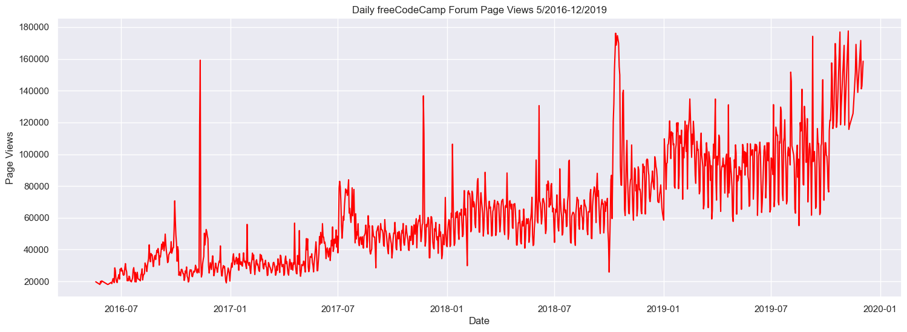
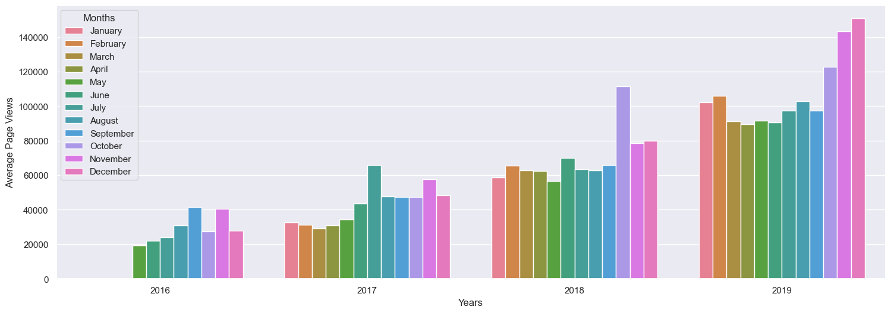
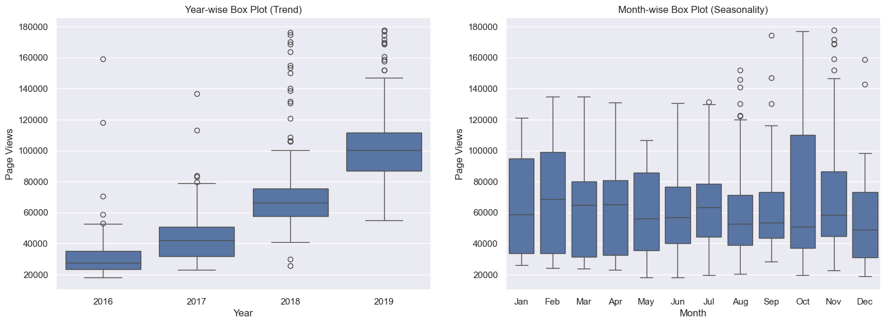

# Page View Time Series Visualizer
For this project you will visualize time series data using a line chart, bar chart, and box plots. You will use Pandas, Matplotlib, and Seaborn to visualize a dataset containing the number of page views each day on the freeCodeCamp.org forum from 2016-05-09 to 2019-12-03. The data visualizations will help you understand the patterns in visits and identify yearly and monthly growth.

Use the data to complete the following tasks:

-   Use Pandas to import the data from "fcc-forum-pageviews.csv". Set the index to the  `date`  column.
-   Clean the data by filtering out days when the page views were in the top 2.5% of the dataset or bottom 2.5% of the dataset.
-   Create a  `draw_line_plot`  function that uses Matplotlib to draw a line chart similar to "examples/Figure_1.png". The title should be  `Daily freeCodeCamp Forum Page Views 5/2016-12/2019`. The label on the x axis should be  `Date`  and the label on the y axis should be  `Page Views`.
-   Create a  `draw_bar_plot`  function that draws a bar chart similar to "examples/Figure_2.png". It should show average daily page views for each month grouped by year. The legend should show month labels and have a title of  `Months`. On the chart, the label on the x axis should be  `Years`  and the label on the y axis should be  `Average Page Views`.
-   Create a  `draw_box_plot`  function that uses Seaborn to draw two adjacent box plots similar to "examples/Figure_3.png". These box plots should show how the values are distributed within a given year or month and how it compares over time. The title of the first chart should be  `Year-wise Box Plot (Trend)`  and the title of the second chart should be  `Month-wise Box Plot (Seasonality)`. Make sure the month labels on bottom start at  `Jan`  and the x and y axis are labeled correctly. The boilerplate includes commands to prepare the data.

Link to the original subject: https://www.freecodecamp.org/learn/data-analysis-with-python/data-analysis-with-python-projects/page-view-time-series-visualizer

# My Work
To handle this work, let's go over each bullet point until there is none remaining.

## Use Pandas to import the data from "fcc-forum-pageviews.csv". Set the index to the  `date`  column.
Here is our import section.


```python
import matplotlib.pyplot as plt
import pandas as pd
import seaborn as sns
from pandas.plotting import register_matplotlib_converters
register_matplotlib_converters()

df = pd.read_csv(
    "fcc-forum-pageviews.csv"
)
df.head()
```


<div>
<style scoped>
    .dataframe tbody tr th:only-of-type {
        vertical-align: middle;
    }

    .dataframe tbody tr th {
        vertical-align: top;
    }

    .dataframe thead th {
        text-align: right;
    }
</style>
<table border="1" class="dataframe">
  <thead>
    <tr style="text-align: right;">
      <th></th>
      <th>date</th>
      <th>value</th>
    </tr>
  </thead>
  <tbody>
    <tr>
      <th>0</th>
      <td>2016-05-09</td>
      <td>1201</td>
    </tr>
    <tr>
      <th>1</th>
      <td>2016-05-10</td>
      <td>2329</td>
    </tr>
    <tr>
      <th>2</th>
      <td>2016-05-11</td>
      <td>1716</td>
    </tr>
    <tr>
      <th>3</th>
      <td>2016-05-12</td>
      <td>10539</td>
    </tr>
    <tr>
      <th>4</th>
      <td>2016-05-13</td>
      <td>6933</td>
    </tr>
  </tbody>
</table>
</div>


And here we're setting the date as the index.


```python
df['date'] = pd.to_datetime(df['date'])
df = df.set_index("date")
df.head()
```


<div>
<style scoped>
    .dataframe tbody tr th:only-of-type {
        vertical-align: middle;
    }

    .dataframe tbody tr th {
        vertical-align: top;
    }

    .dataframe thead th {
        text-align: right;
    }
</style>
<table border="1" class="dataframe">
  <thead>
    <tr style="text-align: right;">
      <th></th>
      <th>value</th>
    </tr>
    <tr>
      <th>date</th>
      <th></th>
    </tr>
  </thead>
  <tbody>
    <tr>
      <th>2016-05-09</th>
      <td>1201</td>
    </tr>
    <tr>
      <th>2016-05-10</th>
      <td>2329</td>
    </tr>
    <tr>
      <th>2016-05-11</th>
      <td>1716</td>
    </tr>
    <tr>
      <th>2016-05-12</th>
      <td>10539</td>
    </tr>
    <tr>
      <th>2016-05-13</th>
      <td>6933</td>
    </tr>
  </tbody>
</table>
</div>


## Clean the data by filtering out days when the page views were in the top 2.5% of the dataset or bottom 2.5% of the dataset.


```python
df = df[
    (df["value"] >= df["value"].quantile(0.025)) &
    (df["value"] <= df["value"].quantile(0.975))
]
df.head()
```


<div>
<style scoped>
    .dataframe tbody tr th:only-of-type {
        vertical-align: middle;
    }

    .dataframe tbody tr th {
        vertical-align: top;
    }

    .dataframe thead th {
        text-align: right;
    }
</style>
<table border="1" class="dataframe">
  <thead>
    <tr style="text-align: right;">
      <th></th>
      <th>value</th>
    </tr>
    <tr>
      <th>date</th>
      <th></th>
    </tr>
  </thead>
  <tbody>
    <tr>
      <th>2016-05-19</th>
      <td>19736</td>
    </tr>
    <tr>
      <th>2016-05-26</th>
      <td>18060</td>
    </tr>
    <tr>
      <th>2016-05-27</th>
      <td>19997</td>
    </tr>
    <tr>
      <th>2016-05-28</th>
      <td>19044</td>
    </tr>
    <tr>
      <th>2016-05-29</th>
      <td>20325</td>
    </tr>
  </tbody>
</table>
</div>


## Create a  `draw_line_plot`  function that uses Matplotlib to draw a line chart similar to "examples/Figure_1.png". The title should be  `Daily freeCodeCamp Forum Page Views 5/2016-12/2019`. The label on the x axis should be  `Date`  and the label on the y axis should be  `Page Views`.


```python
df_line = df
fig, axes = plt.subplots(1, 1)
sns.set(rc={'figure.figsize':(18,6)})
sns.lineplot(data=df_line, x="date", y="value", color="red", ax=axes)
axes.set_title("Daily freeCodeCamp Forum Page Views 5/2016-12/2019")
axes.set_xlabel("Date")
axes.set_ylabel("Page Views")
```


    Text(0, 0.5, 'Page Views')


    

    


This line plot shows us that page views for the freeCodeCamp website have increased over the years from 5/2016 to 12/2019 which implies that the website has increased in popularity over the years (up to 2019 at least).

## Create a  `draw_bar_plot`  function that draws a bar chart similar to "examples/Figure_2.png". It should show average daily page views for each month grouped by year. The legend should show month labels and have a title of  `Months`. On the chart, the label on the x axis should be  `Years`  and the label on the y axis should be  `Average Page Views`.
First, we need to make a copy of the DataFrame and split the date.


```python
df_bar = df.copy()
df_bar['day'] = df_bar.index.day
df_bar['Months'] = df_bar.index.month
df_bar['year'] = df_bar.index.year
df_bar.head()
```


<div>
<style scoped>
    .dataframe tbody tr th:only-of-type {
        vertical-align: middle;
    }

    .dataframe tbody tr th {
        vertical-align: top;
    }

    .dataframe thead th {
        text-align: right;
    }
</style>
<table border="1" class="dataframe">
  <thead>
    <tr style="text-align: right;">
      <th></th>
      <th>value</th>
      <th>day</th>
      <th>Months</th>
      <th>year</th>
    </tr>
    <tr>
      <th>date</th>
      <th></th>
      <th></th>
      <th></th>
      <th></th>
    </tr>
  </thead>
  <tbody>
    <tr>
      <th>2016-05-19</th>
      <td>19736</td>
      <td>19</td>
      <td>5</td>
      <td>2016</td>
    </tr>
    <tr>
      <th>2016-05-26</th>
      <td>18060</td>
      <td>26</td>
      <td>5</td>
      <td>2016</td>
    </tr>
    <tr>
      <th>2016-05-27</th>
      <td>19997</td>
      <td>27</td>
      <td>5</td>
      <td>2016</td>
    </tr>
    <tr>
      <th>2016-05-28</th>
      <td>19044</td>
      <td>28</td>
      <td>5</td>
      <td>2016</td>
    </tr>
    <tr>
      <th>2016-05-29</th>
      <td>20325</td>
      <td>29</td>
      <td>5</td>
      <td>2016</td>
    </tr>
  </tbody>
</table>
</div>


Then, we need to get the mean of the value field grouped by year/month.


```python
df_bar_grouped = df_bar.groupby(["year","Months"]).mean()
df_bar_grouped.head()
```


<div>
<style scoped>
    .dataframe tbody tr th:only-of-type {
        vertical-align: middle;
    }

    .dataframe tbody tr th {
        vertical-align: top;
    }

    .dataframe thead th {
        text-align: right;
    }
</style>
<table border="1" class="dataframe">
  <thead>
    <tr style="text-align: right;">
      <th></th>
      <th></th>
      <th>value</th>
      <th>day</th>
    </tr>
    <tr>
      <th>year</th>
      <th>Months</th>
      <th></th>
      <th></th>
    </tr>
  </thead>
  <tbody>
    <tr>
      <th rowspan="5" valign="top">2016</th>
      <th>5</th>
      <td>19432.400000</td>
      <td>25.800000</td>
    </tr>
    <tr>
      <th>6</th>
      <td>21875.105263</td>
      <td>20.105263</td>
    </tr>
    <tr>
      <th>7</th>
      <td>24109.678571</td>
      <td>14.857143</td>
    </tr>
    <tr>
      <th>8</th>
      <td>31049.193548</td>
      <td>16.000000</td>
    </tr>
    <tr>
      <th>9</th>
      <td>41476.866667</td>
      <td>15.500000</td>
    </tr>
  </tbody>
</table>
</div>


After this, we need to convert the month field from integers to actual month names.


```python
df_bar_grouped.index = df_bar_grouped.index.set_levels( pd.to_datetime(df_bar_grouped.index.levels[1], format='%m').month_name(), level=1 )
df_bar_grouped.head()
```


<div>
<style scoped>
    .dataframe tbody tr th:only-of-type {
        vertical-align: middle;
    }

    .dataframe tbody tr th {
        vertical-align: top;
    }

    .dataframe thead th {
        text-align: right;
    }
</style>
<table border="1" class="dataframe">
  <thead>
    <tr style="text-align: right;">
      <th></th>
      <th></th>
      <th>value</th>
      <th>day</th>
    </tr>
    <tr>
      <th>year</th>
      <th>Months</th>
      <th></th>
      <th></th>
    </tr>
  </thead>
  <tbody>
    <tr>
      <th rowspan="5" valign="top">2016</th>
      <th>May</th>
      <td>19432.400000</td>
      <td>25.800000</td>
    </tr>
    <tr>
      <th>June</th>
      <td>21875.105263</td>
      <td>20.105263</td>
    </tr>
    <tr>
      <th>July</th>
      <td>24109.678571</td>
      <td>14.857143</td>
    </tr>
    <tr>
      <th>August</th>
      <td>31049.193548</td>
      <td>16.000000</td>
    </tr>
    <tr>
      <th>September</th>
      <td>41476.866667</td>
      <td>15.500000</td>
    </tr>
  </tbody>
</table>
</div>


And then we can finally make our bar plot.


```python
fig, axes = plt.subplots(1, 1)
sns.barplot(
    data=df_bar_grouped,
    x="year",
    y="value",
    hue="Months",
    hue_order=[
        "January", "February", "March", "April", "May", "June", "July", "August", "September", "October", "November", "December"
    ],
    ax = axes
)
axes.set_xlabel("Years")
axes.set_ylabel("Average Page Views")
```


    Text(0, 0.5, 'Average Page Views')


    

    


This bar plot shows us that the average page views for the freeCodeCamp website is higher at the end of the year. This could be explained by the job market. People looking to get a new job usually get a new one during January or February, at the start of the year. In order to prepare for that, it makes sense that they would try to improve their resumes by getting more skills, thus coming on freeCodeCamp to increase their chances of landing a new job.

## Create a  `draw_box_plot`  function that uses Seaborn to draw two adjacent box plots. These box plots should show how the values are distributed within a given year or month and how it compares over time. The title of the first chart should be  `Year-wise Box Plot (Trend)`  and the title of the second chart should be  `Month-wise Box Plot (Seasonality)`. Make sure the month labels on bottom start at  `Jan`  and the x and y axis are labeled correctly. The boilerplate includes commands to prepare the data.
First, we need to prepare the data.


```python
df_box = df.copy()
df_box.reset_index(inplace=True)
df_box['year'] = [d.year for d in df_box.date]
df_box['month'] = [d.strftime('%b') for d in df_box.date]
df_box.head()
```


<div>
<style scoped>
    .dataframe tbody tr th:only-of-type {
        vertical-align: middle;
    }

    .dataframe tbody tr th {
        vertical-align: top;
    }

    .dataframe thead th {
        text-align: right;
    }
</style>
<table border="1" class="dataframe">
  <thead>
    <tr style="text-align: right;">
      <th></th>
      <th>date</th>
      <th>value</th>
      <th>year</th>
      <th>month</th>
    </tr>
  </thead>
  <tbody>
    <tr>
      <th>0</th>
      <td>2016-05-19</td>
      <td>19736</td>
      <td>2016</td>
      <td>May</td>
    </tr>
    <tr>
      <th>1</th>
      <td>2016-05-26</td>
      <td>18060</td>
      <td>2016</td>
      <td>May</td>
    </tr>
    <tr>
      <th>2</th>
      <td>2016-05-27</td>
      <td>19997</td>
      <td>2016</td>
      <td>May</td>
    </tr>
    <tr>
      <th>3</th>
      <td>2016-05-28</td>
      <td>19044</td>
      <td>2016</td>
      <td>May</td>
    </tr>
    <tr>
      <th>4</th>
      <td>2016-05-29</td>
      <td>20325</td>
      <td>2016</td>
      <td>May</td>
    </tr>
  </tbody>
</table>
</div>


And then we can make our box plots.


```python
fig, axes = plt.subplots(1, 2)
sns.boxplot(data=df_box, x="year", y="value", ax=axes[0]).set_title("Year-wise Box Plot (Trend)")
axes[0].set_xlabel("Year")
axes[0].set_ylabel("Page Views")
sns.boxplot(data=df_box, x="month", y="value", ax=axes[1], order=[
        "Jan", "Feb", "Mar", "Apr", "May", "Jun", "Jul", "Aug", "Sep", "Oct", "Nov", "Dec"
    ]).set_title("Month-wise Box Plot (Seasonality)")
axes[1].set_xlabel("Month")
axes[1].set_ylabel("Page Views")
```


    Text(0, 0.5, 'Page Views')


    

    


These box plots pretty much confirm the hypothesis given by looking at the 2 previous plots. Looking at the Year-wise Box Plot, we can see that the overall Page Views are increasing as the years pass. 
Looking at the Month-Wise Box Plot, we can see that the number of Page views are higher at the end of the year, with higher peaks.
