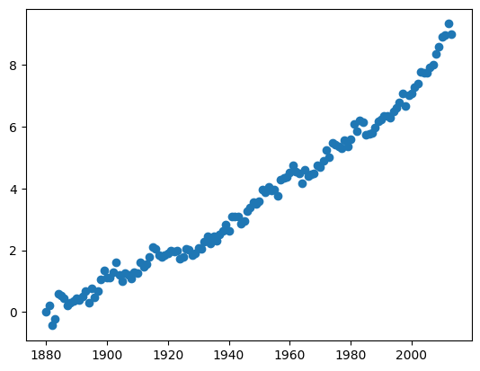
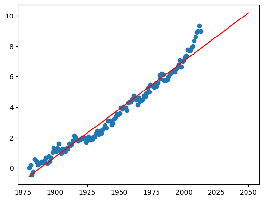
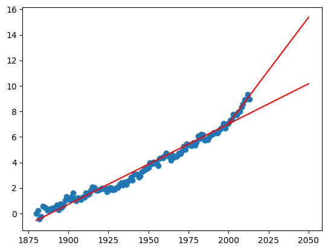
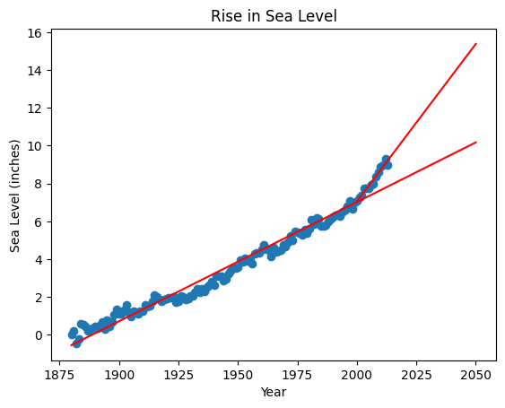

# Sea Level Predictor
You will analyze a dataset of the global average sea level change since 1880. You will use the data to predict the sea level change through year 2050.

Use the data to complete the following tasks:

-   Use Pandas to import the data from  `epa-sea-level.csv`.
-   Use matplotlib to create a scatter plot using the  `Year`  column as the x-axis and the  `CSIRO Adjusted Sea Level`  column as the y-axis.
-   Use the  `linregress`  function from  `scipy.stats`  to get the slope and y-intercept of the line of best fit. Plot the line of best fit over the top of the scatter plot. Make the line go through the year 2050 to predict the sea level rise in 2050.
-   Plot a new line of best fit just using the data from year 2000 through the most recent year in the dataset. Make the line also go through the year 2050 to predict the sea level rise in 2050 if the rate of rise continues as it has since the year 2000.
-   The x label should be  `Year`, the y label should be  `Sea Level (inches)`, and the title should be  `Rise in Sea Level`.

Link to the original subject: https://www.freecodecamp.org/learn/data-analysis-with-python/data-analysis-with-python-projects/sea-level-predictor

# My Work
In order to complete this work, I'm going to go over each bullet point until the task is fully completed.

## Use Pandas to import the data from  `epa-sea-level.csv`.
Here are our import statements.


```python
import pandas as pd
import matplotlib.pyplot as plt
from scipy.stats import linregress

df = pd.read_csv("epa-sea-level.csv")
df.head()
```


<div>
<style scoped>
    .dataframe tbody tr th:only-of-type {
        vertical-align: middle;
    }

    .dataframe tbody tr th {
        vertical-align: top;
    }

    .dataframe thead th {
        text-align: right;
    }
</style>
<table border="1" class="dataframe">
  <thead>
    <tr style="text-align: right;">
      <th></th>
      <th>Year</th>
      <th>CSIRO Adjusted Sea Level</th>
      <th>Lower Error Bound</th>
      <th>Upper Error Bound</th>
      <th>NOAA Adjusted Sea Level</th>
    </tr>
  </thead>
  <tbody>
    <tr>
      <th>0</th>
      <td>1880</td>
      <td>0.000000</td>
      <td>-0.952756</td>
      <td>0.952756</td>
      <td>NaN</td>
    </tr>
    <tr>
      <th>1</th>
      <td>1881</td>
      <td>0.220472</td>
      <td>-0.732283</td>
      <td>1.173228</td>
      <td>NaN</td>
    </tr>
    <tr>
      <th>2</th>
      <td>1882</td>
      <td>-0.440945</td>
      <td>-1.346457</td>
      <td>0.464567</td>
      <td>NaN</td>
    </tr>
    <tr>
      <th>3</th>
      <td>1883</td>
      <td>-0.232283</td>
      <td>-1.129921</td>
      <td>0.665354</td>
      <td>NaN</td>
    </tr>
    <tr>
      <th>4</th>
      <td>1884</td>
      <td>0.590551</td>
      <td>-0.283465</td>
      <td>1.464567</td>
      <td>NaN</td>
    </tr>
  </tbody>
</table>
</div>


## Use matplotlib to create a scatter plot using the  `Year`  column as the x-axis and the  `CSIRO Adjusted Sea Level`  column as the y-axis.


```python
# Create scatter plot
x = df["Year"]
y = df["CSIRO Adjusted Sea Level"]

plt.scatter(x, y)
```


    <matplotlib.collections.PathCollection at 0x2a52e0a3200>


    

    


## Use the  `linregress`  function from  `scipy.stats`  to get the slope and y-intercept of the line of best fit. Plot the line of best fit over the top of the scatter plot. Make the line go through the year 2050 to predict the sea level rise in 2050.


```python
res = linregress(x, y)
x_extended = range(int(x.min()), 2051)

plt.scatter(x, y)
plt.plot(x_extended, res.intercept + res.slope * pd.Series(x_extended), 'r')
```


    [<matplotlib.lines.Line2D at 0x2a52e0a2b10>]


    

    


## Plot a new line of best fit just using the data from year 2000 through the most recent year in the dataset. Make the line also go through the year 2050 to predict the sea level rise in 2050 if the rate of rise continues as it has since the year 2000.


```python
df_short = df[df["Year"] >= 2000]
x_short = df_short["Year"]
y_short = df_short["CSIRO Adjusted Sea Level"]
res_short = linregress(x_short, y_short)
x_short_extended = range(int(x_short.min()), 2051)

plt.scatter(x, y)
plt.plot(x_extended, res.intercept + res.slope * pd.Series(x_extended), 'r')
plt.plot(x_short_extended, res_short.intercept + res_short.slope * pd.Series(x_short_extended), 'r')
```


    [<matplotlib.lines.Line2D at 0x2a53130be60>]


    

    


## The x label should be  `Year`, the y label should be  `Sea Level (inches)`, and the title should be  `Rise in Sea Level`.


```python
plt.scatter(x, y)
plt.plot(x_extended, res.intercept + res.slope * pd.Series(x_extended), 'r')
plt.plot(x_short_extended, res_short.intercept + res_short.slope * pd.Series(x_short_extended), 'r')

plt.xlabel('Year')
plt.ylabel('Sea Level (inches)')
plt.title('Rise in Sea Level')
```


    Text(0.5, 1.0, 'Rise in Sea Level')


    

    


According to these results, we can make the following affirmations:

- If we want to make predictions based on past sea levels from year 1880 to 2013, then the sea level is going to reach around 9-10 inches in 2050.
- If we want to make predictions based on past sea levels from year 2000 to 2013, then the sea level is going to reach around 15-16 inches in 2050.

This difference in results can be explained by the fact that the sea level has been rising faster during the 2000-2013 period compared to the rise speed of the whole 1880-2013 as a whole according to our data. It implies that, the sea has been rising faster during the 2000s which can be linked to global warming. A limitiation of this DataFrame though is that it stops at 2013 so, the results are 10 years old. This is only a prediction based on past data.
